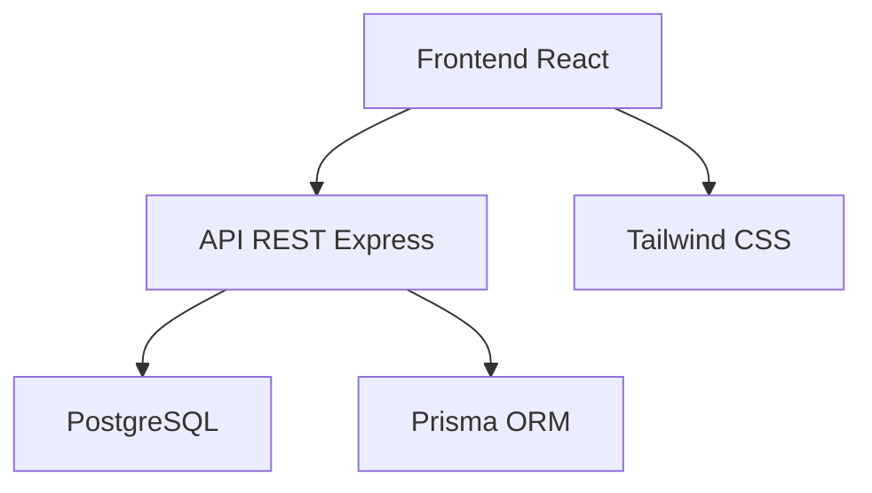

# 🌾 Sistema de Gestión Agrícola

**Estado:** Producción activa | **Node:** >= 18 | **Licencia:** MIT

## 📋 Tabla de Contenidos

- [Descripción General](#descripcion-general)
- [Arquitectura del Sistema](#arquitectura-del-sistema)
- [Estructura del Proyecto](#estructura-del-proyecto)
- [Instalacion Rapida](#instalacion-rapida)
- [Desarrollo](#desarrollo)
- [Documentacion](#documentacion)
- [Contribucion](#contribucion)

## Descripcion General

Sistema integral de gestión agrícola que permite administrar:

- **Maquinaria** y equipos agrícolas
- **Repuestos** y inventario
- **Proveedores** y contactos
- **Reparaciones** y mantenimiento
- **Usuarios** y permisos

## Arquitectura del Sistema



### Stack Tecnológico

| Componente | Tecnología |
|----------|------------|
| Frontend | React 18 + Vite + TypeScript |
| Estilos | Tailwind CSS |
| Backend | Node.js + Express |
| ORM | Prisma |
| Base de datos | PostgreSQL |
| Autenticación | JWT |

## Estructura del Proyecto

```fenced
sistema-gestion-agricola/
├── client/          # Frontend React SPA
├── server/          # Backend API REST
├── docs/           # Documentación técnica
├── scripts/        # Utilidades de deploy
├── data/          # Datos de ejemplo
└── README.md      # Este archivo
```

### 📦 Carpetas Principales

#### [`client/`](./client/README.md)

- **Frontend SPA** en React + TypeScript
- **Build system**: Vite
- **Estilos**: Tailwind CSS
- **Incluye**: Componentes, páginas, hooks, servicios

#### [`server/`](./server/README.md)

- **Backend API** en Node.js + Express
- **ORM**: Prisma con PostgreSQL
- **Autenticación**: JWT
- **Incluye**: Controladores, rutas, modelos, middleware

#### [`docs/`](./docs/README.md)

- **Documentación técnica** completa
- **Guías**: Deployment, API, seguridad
- **Archivos CSV**: Importación de repuestos
- **Logs**: Migraciones y optimizaciones

## Instalacion Rapida

### Requisitos previos

```bash
node -v   # >= 18
npm -v    # >= 8
```

### 1. Clonar y preparar

```bash
git clone [URL_DEL_REPOSITORIO]
cd sistema-gestion-agricola
npm install
```

### 2. Configurar variables de entorno

```bash
# Backend
cp server/.env.example server/.env
# Frontend
cp client/.env.example client/.env
```

### 3. Base de datos

```bash
cd server
npx prisma generate
npx prisma db push
```

## Desarrollo

### Iniciar todos los servicios

```bash
npm run dev          # Frontend + Backend
# o individualmente:
npm run dev:client   # Solo frontend
npm run dev:server   # Solo backend
```

### URLs de desarrollo

- **Frontend**: <http://localhost:5173>
- **Backend**: <http://localhost:4000/api>
- **Health check**: <http://localhost:4000/api/health>

### Scripts disponibles

| Comando | Descripción |
|---------|-------------|
| `npm run dev` | Inicia frontend y backend |
| `npm run dev:client` | Solo frontend |
| `npm run dev:server` | Solo backend |
| `npm run build` | Build producción |
| `npm run deploy` | Deploy a Render |

## Documentacion

### 📖 Guías principales

- [Deployment](./docs/DEPLOYMENT.md) - Deploy en Render
- [API Reference](./docs/API_REFERENCE.md) - Endpoints y respuestas
- [Security](./docs/SECURITY.md) - Prácticas de seguridad
- [Troubleshooting](./docs/TROUBLESHOOTING.md) - Errores comunes

### 🔧 Configuración

- [Setup Desarrollo](./docs/SETUP_DESARROLLO.md) - Configuración completa
- [Sistema de Filtros](./docs/SISTEMA_FILTROS.md) - Filtros avanzados
- [Logging](./docs/SISTEMA_LOGGING_MODULAR.md) - Sistema de logs

### 📊 Importación de datos

- [Repuestos CSV](./docs/repuestos_importacion.csv) - Plantilla de importación
- [Maquinarias](./docs/maquinas/) - Documentación por máquina

## Contribucion

1. Fork el proyecto
2. Crea tu feature branch (`git checkout -b feature/AmazingFeature`)
3. Commit tus cambios (`git commit -m 'Add some AmazingFeature'`)
4. Push a la rama (`git push origin feature/AmazingFeature`)
5. Abre un Pull Request

## 📞 Soporte

- **Issues**: [GitHub Issues](URL_ISSUES)
- **Email**: <soporte@tudominio.com>
- **Documentación**: [Wiki del proyecto](URL_WIKI)

## 📄 Licencia

Este proyecto está bajo la licencia MIT. Ver el archivo [LICENSE](LICENSE) para más detalles.

---

**Nota**: Para información detallada sobre cada componente, consulta los README específicos en cada carpeta.
